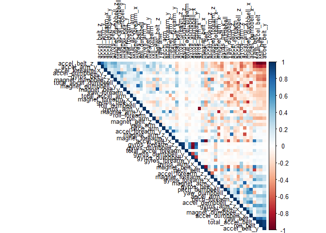
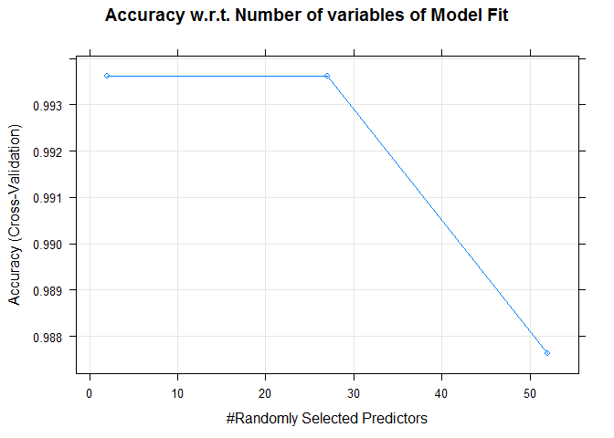
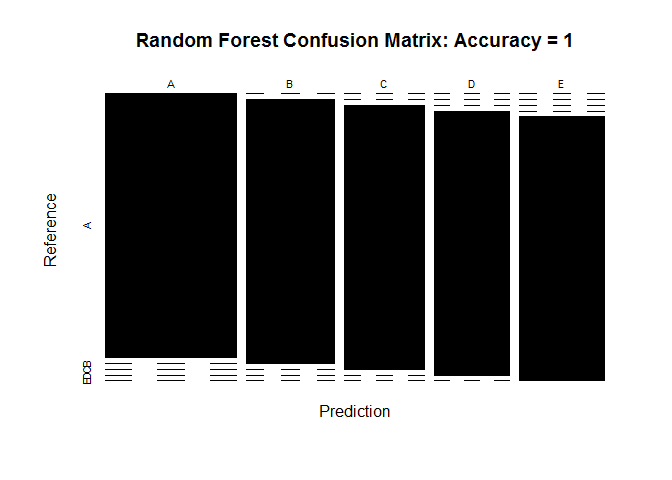

## Overview

Human Activity Recognition - HAR - has emerged as a key research area in the last years and is gaining increasing attention by the pervasive computing research community (see picture below, that illustrates the increasing number of publications in HAR with wearable accelerometers), especially for the development of context-aware systems. There are many potential applications for HAR, like: elderly monitoring, life log systems for monitoring energy expenditure and for supporting weight-loss programs, and digital assistants for weight lifting exercises

Six young health participants were asked to perform one set of 10 repetitions of the Unilateral Dumbbell Biceps Curl in five different fashions: exactly according to the specification (Class A), throwing the elbows to the front (Class B), lifting the dumbbell only halfway (Class C), lowering the dumbbell only halfway (Class D) and throwing the hips to the front (Class E).

## Source

The data for this project come from this source: http://web.archive.org/web/20161224072740/http:/groupware.les.inf.puc-rio.br/har. If you use the document you create for this class for any purpose please cite them as they have been very generous in allowing their data to be used for this kind of assignment.

### Installing Packages & Loading Libraries

Let us install & load libraries that we will require further for building and testing our prediction model.


```r
#install.packages("doParallel")
#install.packages("caret")
#install.packages("randomForest")
#install.packages("e1071")
#install.packages("corrplot")
require(doParallel)
require(caret)
require(randomForest)
require(e1071)
library(corrplot)
```

### Loading the DataSet

Let us download & load the dataset in memory.


```r
if(!dir.exists("activityData")){
      trainURL <- "https://d396qusza40orc.cloudfront.net/predmachlearn/pml-training.csv"
      testURL <- "https://d396qusza40orc.cloudfront.net/predmachlearn/pml-testing.csv"
      dir.create("activityData")
      download.file(trainURL, destfile = "./activityData/training.csv")
      download.file(testURL, destfile = "./activityData/testing.csv")
}
#NA values can be indentified as "NA", "#DIV/0!", "" which are taken care.
training <- read.csv(file = "./activityData/training.csv", na.strings = c("NA", "#DIV/0!", ""))
testing <- read.csv(file = "./activityData/testing.csv", na.strings = c("NA", "#DIV/0!", ""))
```

### Cleaning and Transforming DataSet

In our dataset, we contain additional data(qualitative data & time variables) which are not required for our analysis. We remove these attributes from our training and testing datasets. We also remove the variables that have majority of NULL values from both the datasets.


```r
training <- subset(training, select = -c(1:7))
testing <- subset(testing, select = -c(1:7))
sub <- colSums(is.na(training[,1:ncol(training)])) == 0
training <- training[,sub]
dim(training)
```

```
## [1] 19622    53
```

```r
testing <- testing[,sub]
dim(testing)
```

```
## [1] 20 53
```

### Exploring DataSet

From the below code we can see that no attributes have variance near value zero and that is the reason we need to preprocess our data by scaling our dataset.


```r
nzv(training, saveMetrics = FALSE)
```

```
## integer(0)
```

```r
cor_mat <- cor(training[, -53])
corrplot(cor_mat, order = "FPC", method = "color", type = "upper", 
         tl.cex = 0.8, tl.col = rgb(0, 0, 0))
```

<!-- -->

##Prediction Model

Now, that our dataset is ready let us build a model that will help us predict whether a given person is doing the weight-lifting correct or is he/she facing trouble in their form.

### Partitioning Data for Validation Set

We need to verfiy that our model works correctly and so we need to partition our training data in two groups for training and validation purposes.


```r
inTrain <- createDataPartition(y = training$classe, p = 0.7, list = FALSE)
modTrain <- training[inTrain,]
modTest <- training[-inTrain,]
```

### Model Building - Prediction

As our dataset is large we would prefer performing parallel computation for training our model to reduce time. We will be using random forest to train our model with k = 4 cross validation.


```r
ncores <- makeCluster(detectCores() - 1)
registerDoParallel(cores = ncores)
getDoParWorkers()
```

```
## [1] 3
```

```r
modFit <- train(classe ~ ., data = training, method = "rf", 
                preProcess = c("center","scale"), metric = "Accuracy",
                trControl = trainControl(method = "cv", number = 4, 
                                         p = 0.7, allowParallel = TRUE))
stopCluster(ncores)
modFit
```

```
## Random Forest 
## 
## 19622 samples
##    52 predictor
##     5 classes: 'A', 'B', 'C', 'D', 'E' 
## 
## Pre-processing: centered (52), scaled (52) 
## Resampling: Cross-Validated (4 fold) 
## Summary of sample sizes: 14717, 14716, 14716, 14717 
## Resampling results across tuning parameters:
## 
##   mtry  Accuracy   Kappa    
##    2    0.9936295  0.9919413
##   27    0.9936297  0.9919421
##   52    0.9876161  0.9843343
## 
## Accuracy was used to select the optimal model using the largest value.
## The final value used for the model was mtry = 27.
```


### Model Validation 

Our model gives us a good accuracy measures. Let's see how our model performs on the validation set.


```r
predModTest <- predict(modFit, newdata = modTest)
cmV <- confusionMatrix(predModTest, modTest$classe)
cmV$table
```

```
##           Reference
## Prediction    A    B    C    D    E
##          A 1674    0    0    0    0
##          B    0 1139    0    0    0
##          C    0    0 1026    0    0
##          D    0    0    0  964    0
##          E    0    0    0    0 1082
```

```r
cmV
```

```
## Confusion Matrix and Statistics
## 
##           Reference
## Prediction    A    B    C    D    E
##          A 1674    0    0    0    0
##          B    0 1139    0    0    0
##          C    0    0 1026    0    0
##          D    0    0    0  964    0
##          E    0    0    0    0 1082
## 
## Overall Statistics
##                                      
##                Accuracy : 1          
##                  95% CI : (0.9994, 1)
##     No Information Rate : 0.2845     
##     P-Value [Acc > NIR] : < 2.2e-16  
##                                      
##                   Kappa : 1          
##                                      
##  Mcnemar's Test P-Value : NA         
## 
## Statistics by Class:
## 
##                      Class: A Class: B Class: C Class: D Class: E
## Sensitivity            1.0000   1.0000   1.0000   1.0000   1.0000
## Specificity            1.0000   1.0000   1.0000   1.0000   1.0000
## Pos Pred Value         1.0000   1.0000   1.0000   1.0000   1.0000
## Neg Pred Value         1.0000   1.0000   1.0000   1.0000   1.0000
## Prevalence             0.2845   0.1935   0.1743   0.1638   0.1839
## Detection Rate         0.2845   0.1935   0.1743   0.1638   0.1839
## Detection Prevalence   0.2845   0.1935   0.1743   0.1638   0.1839
## Balanced Accuracy      1.0000   1.0000   1.0000   1.0000   1.0000
```

We see that our model has predicted with Accuracy : 100 %. This is a very good accuracy rate.


```r
plot(modFit, main = "Accuracy w.r.t. Number of variables of Model Fit")
```

<!-- -->

```r
plot(cmV$table, col = cmV$byClass,
     main = paste("Random Forest Confusion Matrix: Accuracy =", 
                  round(cmV$overall['Accuracy'], 4)))
```

<!-- -->

```r
modFit$finalModel$classes
```

```
## [1] "A" "B" "C" "D" "E"
```

### Testing Model on Testing Dataset

Let us predict the outcome based on the testing set for which we do not have the results.


```r
predTestDataSet <- predict(modFit, newdata = testing)
names(predTestDataSet) <- c(1:20)
predTestDataSet
```

```
##  1  2  3  4  5  6  7  8  9 10 11 12 13 14 15 16 17 18 19 20 
##  B  A  B  A  A  E  D  B  A  A  B  C  B  A  E  E  A  B  B  B 
## Levels: A B C D E
```
